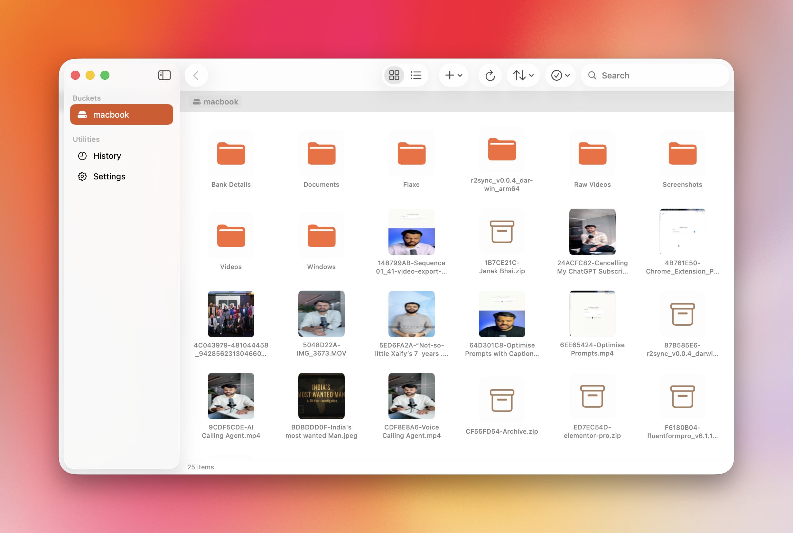

<p align="center">
  
</p>

<h1 align="center">r2Vault</h1>

<p align="center">
  A native macOS client for browsing, managing, and uploading files to Cloudflare R2.
</p>

<p align="center">
  
  
  
  
</p>

---

## Features

**Browse & Navigate**
- Finder-style file browser with breadcrumb navigation
- Icon and List view modes
- Search, sort, and filter files by name, size, date, or kind
- Quick Look preview with spacebar

**Upload**
- Drag-and-drop files and folders directly from Finder
- Concurrent uploads with real-time progress tracking
- Cancel individual uploads or all at once
- Automatic public URL copy to clipboard on upload completion
- Upload history with copy, download, and delete actions

**Menu Bar Widget**
- Lives in the macOS menu bar — always one click away
- Drop files directly onto the popover to upload instantly
- Live per-file upload progress with cancel buttons
- Recent uploads list with copy link, download, and delete
- Stays open while you work — won't dismiss on focus loss

**Manage**
- Create folders and delete files/folders with confirmation dialogs
- Recursive folder deletion — removes all contents in one action
- Batch delete multiple items with a single confirmation
- Multiple R2 bucket support — switch buckets from the gear menu
- Presigned URL generation for secure sharing

**Auto-Update**
- Check for Updates via the app menu (R2 Vault → Check for Updates)
- Automatic in-app download and install of new releases

## Screenshot

<p align="center">
  
</p>

## Installation

### One-line Install (Recommended)

Run this in Terminal — it downloads the latest release, installs it, and handles everything:

```bash
curl -fsSL https://raw.githubusercontent.com/xaif/r2Vault/main/install.sh | bash
```

### Homebrew

```bash
brew install --cask --no-quarantine xaif/tap/r2vault
```

### Manual Download

1. Download the latest DMG from [Releases](https://github.com/xaif/r2Vault/releases/latest)
2. Open the DMG and drag **R2Vault** to **Applications**
3. **Important:** Before opening the app, do **one** of the following:

   **Option A — Right-click to Open (easiest):**
   - Right-click (or Control-click) on R2Vault in Applications
   - Select **Open** from the context menu
   - Click **Open** in the dialog that appears
   - You only need to do this once — after that it opens normally

   **Option B — Terminal command:**
   ```bash
   xattr -dr com.apple.quarantine /Applications/R2Vault.app
   ```

   **Option C — System Settings:**
   - Try to open the app normally (it will be blocked)
   - Go to **System Settings → Privacy & Security**
   - Scroll down and click **Open Anyway** next to the R2Vault message

> **Why is this needed?** r2Vault is free and open source. Apple charges $99/year for app notarization, so macOS treats it as "unidentified". The app is safe — you can [review the source code](https://github.com/xaif/r2Vault) yourself.

### Build from Source

```bash
git clone https://github.com/xaif/r2Vault.git
cd r2Vault
open Fiaxe.xcodeproj
```

Build and run with ⌘R. Requires macOS 15.0+ and Xcode 16+.

## Getting Started

1. Launch r2Vault — it lives in your **menu bar**
2. Open **Settings** (⌘,) and add your R2 credentials:
   - **Account ID** — found in your Cloudflare dashboard
   - **Access Key ID** & **Secret Access Key** — from an R2 API token
   - **Bucket Name**
   - **Custom Domain** (optional) — for public URL generation

## Tech Stack

| Layer | Technology |
|-------|-----------|
| UI | SwiftUI |
| Architecture | MVVM with `@Observable` |
| Concurrency | Swift async/await, TaskGroup |
| Auth | AWS Signature V4 (CryptoKit) |
| Networking | URLSession |
| Storage | UserDefaults, Keychain |
| Menu Bar | AppKit `NSStatusItem` + `NSPopover` |

## Project Structure

```
Fiaxe/
├── Models/
│   ├── R2Credentials.swift       # Bucket credential model
│   ├── R2Object.swift            # File/folder object model
│   ├── UploadItem.swift          # Upload history item
│   └── UploadTask.swift          # Upload task with progress + cancellation
├── Services/
│   ├── AWSV4Signer.swift         # S3-compatible request signing
│   ├── KeychainService.swift     # Credential persistence
│   ├── MenuBarManager.swift      # NSStatusItem + NSPopover management
│   ├── R2BrowseService.swift     # Bucket listing, delete, recursive ops
│   ├── R2UploadService.swift     # File upload with progress streaming
│   ├── ThumbnailCache.swift      # Memory + disk thumbnail cache
│   ├── UpdateService.swift       # GitHub release update checker
│   ├── UploadHistoryStore.swift  # Upload history persistence
│   └── QuickLookCoordinator.swift
├── ViewModels/
│   └── AppViewModel.swift        # Central app state
└── Views/
    ├── BrowserView.swift         # Main file browser
    ├── MenuBarView.swift         # Menu bar popover UI
    ├── SettingsView.swift        # Credentials & preferences
    ├── UploadQueueView.swift     # Active uploads HUD
    ├── UploadHistoryView.swift   # Past uploads
    └── ...
```

## Changelog

See [CHANGELOG.md](CHANGELOG.md) for the full release history.

## License

This project is open source and available under the [MIT License](LICENSE).
