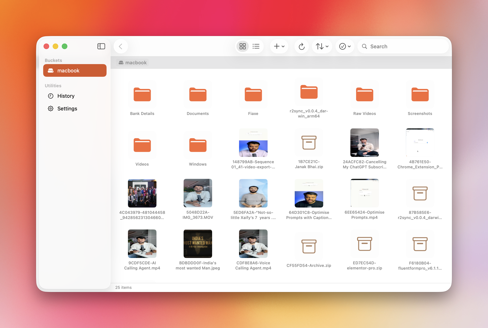

<p align="center">
  
</p>

<h1 align="center">r2Vault</h1>

<p align="center">
  A native Apple client for browsing, managing, and uploading files to Cloudflare R2.
</p>

<p align="center">
  
  
  
  
</p>

---

## Features

**Browse & Navigate**
- Finder-style file browser with breadcrumb navigation
- Icon and List view modes
- Search, sort, and filter files by name, size, date, or kind
- Quick Look preview with spacebar
- Native dashboard views for macOS and iPhone with bucket analytics, upload insights, and file type breakdowns

**Upload**
- Drag-and-drop files and folders directly from Finder
- Concurrent uploads with real-time progress tracking
- Cancel individual uploads or all at once
- Automatic public URL copy to clipboard on upload completion
- Upload history with copy, download, local removal, and delete actions tied to the correct bucket credentials

**Finder Drive (macOS)**
- Mount any bucket as a drive in Finder, listed under Locations next to your Mac's disks
- Files take no disk space until opened, and any app (QuickTime, Final Cut Pro, Photoshop, Preview) can open them directly
- Large files stream in apps that read them directly (IINA, VLC): only the part being played is downloaded, so a big video starts in a second or two. Apps that open documents through macOS (QuickTime, Preview) download the whole file first, as with iCloud Drive
- On macOS 27, the whole folder tree is kept listed in the background, so every folder opens instantly (file contents still download only when opened)
- Downloads don't pile up: use Remove Download in Finder, or let macOS remove them when it needs space. Right-click an item and choose Keep Downloaded to keep it on your Mac. Downloads stop rather than leave less than 2 GB free, and Settings shows how much each drive is using with a Remove Downloads button
- Large uploads pick up where they left off after a dropped connection, sending only the parts R2 doesn't have yet
- Create, rename, move, and delete files and folders in Finder; changes sync to R2
- Deleted items go to the drive's Trash and are removed for good after 30 days
- Changes made elsewhere show up in Finder while R2 Vault is running

**Menu Bar Widget**
- Lives in the macOS menu bar — always one click away
- Drop files directly onto the popover to upload instantly
- Live per-file upload progress with cancel buttons
- Recent uploads list with copy link, download, and delete
- Stays open while you work — won't dismiss on focus loss

**Manage**
- Create folders and delete files/folders with confirmation dialogs
- Recursive folder deletion — removes all contents in one action
- Batch delete multiple items with a single confirmation
- Multiple R2 bucket support — switch buckets from the gear menu
- Presigned URL generation for secure sharing
- Per-bucket history/download resolution so switching buckets does not break history actions

**Auto-Update**
- Check for Updates via the app menu (R2 Vault → Check for Updates)
- Automatic in-app download and install of new releases
- Downloaded DMGs are verified against published SHA-256 checksums before install

**Security & Reliability**
- R2 credentials are stored in the system Keychain
- Installer and updater verify release checksums before replacing the app
- Safer staged app replacement avoids delete-first update failures
- Share/import handling avoids simple filename collisions and large in-memory fallbacks
- Custom domain input is normalized to clean `https` URLs before use

## What's New in v2.0.0

- **Finder Drive (macOS):** mount a bucket as a drive in Finder. Files use no disk space until opened, large files stream on demand, and changes made in Finder sync back to R2. On macOS 27, the whole folder tree stays listed in the background so folders open instantly
- **Jurisdictions:** buckets in the EU, FedRAMP, or US jurisdiction now work. Set it in Settings, or paste the bucket's S3 endpoint during setup
- **Welcome screen:** a first-launch walkthrough on macOS and iOS that connects your first bucket, checks the connection, and explains how to create an R2 API token
- **Stays in the menu bar:** ⌘Q now closes R2 Vault's windows instead of quitting. To fully quit, use Quit R2 Vault in the menu bar menu
- Fixed a crash when previewing videos on macOS
- The Homebrew cask now requires macOS 26, matching the app's minimum

See the [changelog](CHANGELOG.md) for full details.

## Screenshot

<p align="center">
  
</p>

## Installation

Requires macOS 26.2 or later (macOS 27 supported). The iOS app is available through AltStore/SideStore.

### Homebrew (Recommended)

```bash
brew install --cask xaif/tap/r2vault
```

### Manual Download

1. Download the latest DMG from [Releases](https://github.com/xaif/r2Vault/releases/latest)
2. Open the DMG and drag **R2Vault** to **Applications**
3. If macOS warns because the app is not notarized, do **one** of the following:

   **Option A — Right-click to Open (easiest):**
   - Right-click (or Control-click) on R2Vault in Applications
   - Select **Open** from the context menu
   - Click **Open** in the dialog that appears
   - You only need to do this once — after that it opens normally

   **Option B — System Settings:**
   - Try to open the app normally (it will be blocked)
   - Go to **System Settings → Privacy & Security**
   - Scroll down and click **Open Anyway** next to the R2Vault message

> **Why is this needed?** r2Vault is free and open source. Apple charges $99/year for app notarization, so macOS treats it as "unidentified". The app is safe — you can [review the source code](https://github.com/xaif/r2Vault) yourself.

### Terminal Installer

If you prefer an automated install, the bundled installer downloads the latest release and verifies its published checksum before installing it:

```bash
curl -fsSL https://raw.githubusercontent.com/xaif/r2Vault/main/install.sh | bash
```

### Build from Source

```bash
git clone https://github.com/xaif/r2Vault.git
cd r2Vault
open Fiaxe.xcodeproj
```

Build and run with ⌘R. Requires modern Xcode and current Apple platform SDKs.

## Getting Started

1. Launch r2Vault. On first launch, a welcome screen walks you through connecting your first bucket, and it checks the connection before saving. On macOS the app then lives in your **menu bar**. To add more buckets later:
2. Open **Settings** (⌘,) and add your R2 credentials:
   - **Account ID** — found in your Cloudflare dashboard
   - **Access Key ID** & **Secret Access Key** — from an R2 API token
   - **Bucket Name**
   - **Custom Domain** (optional) — for public URL generation
   - **Jurisdiction** (optional) — only if the bucket was created in one, such as EU
3. *(Optional, macOS)* Under **Finder Drive** in Settings, turn on **Show in Finder**. The first time, macOS asks you to approve the drive: switch on R2Vault under **System Settings → General → Login Items & Extensions → File Providers**. The bucket then appears in Finder under Locations.

## Tech Stack

| Layer | Technology |
|-------|-----------|
| UI | SwiftUI |
| Architecture | MVVM with `@Observable` |
| Concurrency | Swift async/await, TaskGroup |
| Auth | AWS Signature V4 (CryptoKit) |
| Networking | URLSession |
| Storage | Keychain, UserDefaults |
| Menu Bar | AppKit `NSStatusItem` + `NSPopover` |

## Project Structure

```
Fiaxe/
├── Models/
│   ├── R2Credentials.swift       # Bucket credential model
│   ├── R2Object.swift            # File/folder object model
│   ├── UploadItem.swift          # Upload history item
│   └── UploadTask.swift          # Upload task with progress + cancellation
├── Services/
│   ├── AWSV4Signer.swift         # S3-compatible request signing
│   ├── KeychainService.swift     # Secure credential persistence
│   ├── MenuBarManager.swift      # NSStatusItem + NSPopover management
│   ├── R2BrowseService.swift     # Bucket listing, delete, recursive ops
│   ├── R2UploadService.swift     # File upload with progress streaming
│   ├── ThumbnailCache.swift      # Memory + disk thumbnail cache
│   ├── UpdateService.swift       # GitHub release update checker
│   ├── AppUpdater.swift          # Verified in-app updater for macOS releases
│   ├── FinderDriveManager.swift  # Adds/removes Finder drives, hands them credentials
│   ├── FinderDriveShared.swift   # Constants + XPC protocol shared with the extension
│   ├── UploadHistoryStore.swift  # Upload history persistence
│   └── QuickLookCoordinator.swift
├── ViewModels/
│   └── AppViewModel.swift        # Central app state
└── Views/
    ├── BrowserView.swift         # Main file browser
    ├── MenuBarView.swift         # Menu bar popover UI
    ├── SettingsView.swift        # Credentials & preferences
    ├── UploadQueueView.swift     # Active uploads HUD
    ├── UploadHistoryView.swift   # Past uploads
    └── ...

R2VaultFileProvider/              # macOS File Provider extension (Finder drive)
├── FileProviderExtension.swift   # Extension entry point, enumerators, XPC control service
├── R2Drive.swift                 # Listing, streaming downloads, uploads, moves, Trash
├── R2Client.swift                # S3 calls incl. ranged GET, multipart upload/copy
├── ItemDatabase.swift            # SQLite map of stable item IDs to R2 keys + change log
└── FileProviderItem.swift        # NSFileProviderItem for bucket entries
```

## Changelog

See [CHANGELOG.md](CHANGELOG.md) for the full release history.

## License

This project is open source and available under the [MIT License](LICENSE).
